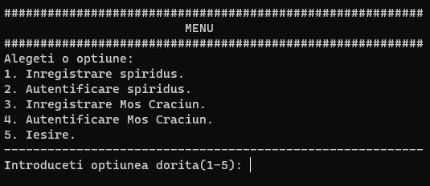

<br/>
<p align="center">
  <a href="https://github.com/ShaanCoding/ReadME-Generator">
    
  </a>

  <h3 align="center">ReadME Generator</h3>

  <p align="center">
    An Awesome ReadME Generator To Jumpstart Your Projects!
    <br/>
    <br/>
    <a href="https://github.com/ShaanCoding/ReadME-Generator"><strong>Explore the docs »</strong></a>
    <br/>
    <br/>
    <a href="https://github.com/ShaanCoding/ReadME-Generator">View Demo</a>
    .
    <a href="https://github.com/ShaanCoding/ReadME-Generator/issues">Report Bug</a>
    .
    <a href="https://github.com/ShaanCoding/ReadME-Generator/issues">Request Feature</a>
  </p>
</p>

    

## Table Of Contents

* [About the Project](#about-the-project)
* [Built With](#built-with)
* [Getting Started](#getting-started)
  * [Prerequisites](#prerequisites)
  * [Installation](#installation)
* [Usage](#usage)
* [Roadmap](#roadmap)
* [Contributing](#contributing)
* [License](#license)
* [Authors](#authors)
* [Acknowledgements](#acknowledgements)

## About The Project



Dragă programatorule,

Sunt ajutorul principal al lui Moș Crăciun în perioada sărbătorilor de iarnă, spiridușul Alabaster, și îți scriu tocmai de la Polul Nord pentru a-ți cere ajutorul.
Sărbătorile de anul acesta au fost cu ceva peripeții pentru Moș Crăciun, pentru că Moșul, încăpățânat că nu a îmbătrânit, a vrut să păstreze doar pe hârtie listele cu copiii cuminți și cadourile pe care aceștia și le doreau. Toate lucrurile au mers bine, până cu câteva zile înainte de Crăciun, când Moșul, puțin răcit fiind, a strănutat mai puternic și a amestecat toate hârtiile. În grabă și bazându-se pe memoria sa, Moșul a refăcut listele, însă acum nu mai este sigur că le-a refăcut corect și recunoaște că este posibil să fi încurcat unele cadouri (cel puțin este bine că nu a uitat să ducă vreun cadou). De aceea, Moșul a acceptat modernizarea atelierului prin implementarea unei aplicații software care să gestioneze tot ceea ce își nota pe hârtiile sale.
Rugămintea mea este să ne sprijini în dezvoltarea acestei aplicații, care să ne permită să facem următoarele operațiuni:

Crearea și actualizarea listelor cu copii și anumite caracteristici ale acestora, precum:
Nume și prenume
Data nașterii (în format Zi / Lună / An)
Cadoul/cadourile dorit/e
Cadoul/cadourile primit/e
Dacă a fost cuminte sau nu
Adresa sau adresele la care poate fi găsit (în cazul mai multor adrese, care dintre acestea este cea curentă)
Crearea și actualizarea stocurilor de cadouri, ținând cont că:
Fiecare cadou poate avea mai multe componente;
Fiecare componentă poate avea atât atribute comune (precum culoare sau dimensiune), precum și anumite atribute specifice (precum număr cai putere în cazul, motorului unei mașinuțe);
Pentru expediere, fiecare cadou va putea fi ambalat fie prin punerea într-o cutie, fie prin împachetarea cu hârtie de cadouri;
Vor fi create conturi diferite pentru accesul la aplicație, astfel:
Listele de cadouri și de copii vor putea fi administrată doar de către Moș Crăciun, printr-un cont specific;
Lista cu cadourile create în atelier va putea fi administrată doar de către spiriduși (fiecare spiriduș va avea contul propriu)
Conturile vor fi create de către fiecare persoană în parte, prin intermediul unei opțiuni de înregistrare.
Fiecare cont va fi identificat pe baza unui nume de utilizator și a unei parole.
Pentru a ușura procesul de actualizare a funcționalităților aplicației, toate elementele care presupun stocarea unor informații (de exemplu: listele de cadouri, listele cu componentele aferente cadourilor, listele cu copii, lista cu conturile de utilizator, etc.) vor fi păstrate într-o structură de tip Bază de date (BD). Această BD va fi creată sub forma unor tabele care vor fi legate între ele prin relații între id-uri stabilite intern, de către dezvoltator (un exemplu de cum pot fi stabilite aceste relații, îl găsești aici ). Fiecare tabelă din BD va avea asignat un fișier pe disc, în care va fi salvată starea acestora atunci când aplicația este închisă. Toate operațiile cu datele din BD vor fi făcute prin intermediul unui nivel intermediar, care va implementa operații de tipul:

Create, pentru introducerea unor informații în BD;
Read, pentru citirea unor informații din BD;
Update, pentru actualizarea unor informații din BD;
Delete, pentru ștergerea unor informații din BD.
Orice acțiune efectuată de un utilizator va fi jurnalizată prin intermediul unui logger unic la nivelul aplicației, care va scrie într-un fișier-jurnal cu extensia .log, toate aceste acțiuni. Intrările din acest fișier-jurnal vor cuprinde informații despre momentul la care s-a întâmplat acțiunea, numele utilizatorului care a realizat acțiunea și câteva informații despre acțiune. De asemenea, pentru a fi simplă de utilizat, aplicația va avea nevoie de un meniu prin care utilizatorii să poată accesa funcționalitățile menționate anterior, care le vor permite să administreze eficient atelierul cu jucării al lui Moș Crăciun. Dacă vei identifica alte elemente care ar trebui introduse sau legături între acestea, care nu au fost menționate în această scrisoare, le poți introduce fără probleme, cât timp funcționalitățile cerute sunt îndeplinite, iar cerințele de aici sunt atinse integral. Sper că vei da curs cererii de ajutor și că vei putea implementa cât mai rapid această aplicație, pentru a fi pregătiți pentru următoarele sărbători de Crăciun.

Cu multă recunoștință,
Alabaster
Spiridușul lui Moș Crăciun

Clarificări suplimentare:

Pot fi utilizate toate noțiunile discute în cadrul laboratoarelor și la curs, inclusiv elemente din STL.
Nu vor fi folosite SGBD (Sisteme de Gestiune a Bazelor de Date), precum Microsoft SQL Server sau MySQL, pentru implementarea cerințelor privind crearea unei BD și a structurii acesteia.
Nu există o limitare privind structura fișierelor aferente BD, prin urmare puteți introduce orice informații considerați că vă sunt necesare.
Se vor trata cazurile de excepție (de exemplu: parola greșită la logare introdusa de prea multe ori, nu exista anumite intrări în tabele, etc.) prin afișarea unor mesaje corespunzătoare de eroare.
Trebuie să existe mecanismul de copiere a unui cadou pe baza altui cadou deja construit.
Ce ne dorim să vedem:

Aplicarea tuturor conceptelor POO acumulate;
Implementarea corectă a relațiilor dintre clase;
Identificarea necesității folosirii Design Pattern-urilor și implementarea corectă a acestora;
Utilizarea conceptelor de Încapsulare, Moștenire, Polimorfism, Abstractizare;
Utilizarea de clase Abstracte și de Interfețe;
Utilizarea conceptului de destructor virtual;
Identificarea operatorilor ce pot fi supraîncărcați și supraîncărcarea lor pentru o soluție intuitivă;
Aplicarea șabloanelor (template-urilor), ori de câte ori găsiți că sunt necesare, și specializarea lor la nevoie;
Modularizarea programului prin toate mijloacele puse la dispoziție (ex. clase, namespace-uri) (Același sfat: lucrați ca și cum altcineva ar urma să folosească sursele voastre);
Implementarea unui mecanism de excepții la nivelul proiectului, mecanism aflat în strânsă legătură cu cel de logare;
Utilizarea containerelor și algoritmilor din Standard Template Library ori de câte ori situația o impune.

## Built With

This section should list any major frameworks that you built your project using. Leave any add-ons/plugins for the acknowledgements section. Here are a few examples.

## Getting Started

This is an example of how you may give instructions on setting up your project locally.
To get a local copy up and running follow these simple example steps.

### Prerequisites

This is an example of how to list things you need to use the software and how to install them.

* npm

```sh
npm install npm@latest -g
```

### Installation

1. Get a free API Key at [https://example.com](https://example.com)

2. Clone the repo

```sh
git clone https://github.com/your_username_/Project-Name.git
```

3. Install NPM packages

```sh
npm install
```

4. Enter your API in `config.js`

```JS
const API_KEY = 'ENTER YOUR API';
```

## Usage

Use this space to show useful examples of how a project can be used. Additional screenshots, code examples and demos work well in this space. You may also link to more resources.

_For more examples, please refer to the [Documentation](https://example.com)_

## Roadmap

See the [open issues](https://github.com/ShaanCoding/ReadME-Generator/issues) for a list of proposed features (and known issues).

## Contributing

Contributions are what make the open source community such an amazing place to be learn, inspire, and create. Any contributions you make are **greatly appreciated**.
* If you have suggestions for adding or removing projects, feel free to [open an issue](https://github.com/ShaanCoding/ReadME-Generator/issues/new) to discuss it, or directly create a pull request after you edit the *README.md* file with necessary changes.
* Please make sure you check your spelling and grammar.
* Create individual PR for each suggestion.
* Please also read through the [Code Of Conduct](https://github.com/ShaanCoding/ReadME-Generator/blob/main/CODE_OF_CONDUCT.md) before posting your first idea as well.

### Creating A Pull Request

1. Fork the Project
2. Create your Feature Branch (`git checkout -b feature/AmazingFeature`)
3. Commit your Changes (`git commit -m 'Add some AmazingFeature'`)
4. Push to the Branch (`git push origin feature/AmazingFeature`)
5. Open a Pull Request

## License

Distributed under the MIT License. See [LICENSE](https://github.com/ShaanCoding/ReadME-Generator/blob/main/LICENSE.md) for more information.

## Authors

* **Shaan Khan** - *Comp Sci Student* - [Shaan Khan](https://github.com/ShaanCoding/) - *Built ReadME Template*

## Acknowledgements

* [ShaanCoding](https://github.com/ShaanCoding/)
* [Othneil Drew](https://github.com/othneildrew/Best-README-Template)
* [ImgShields](https://shields.io/)
